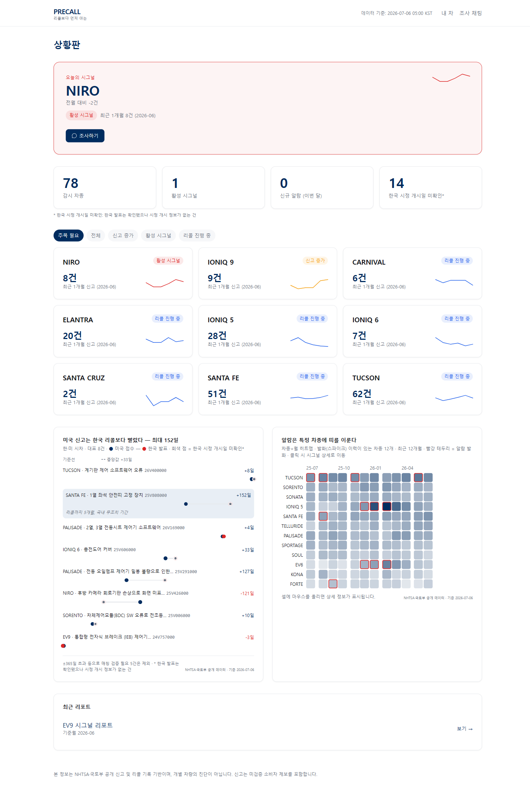
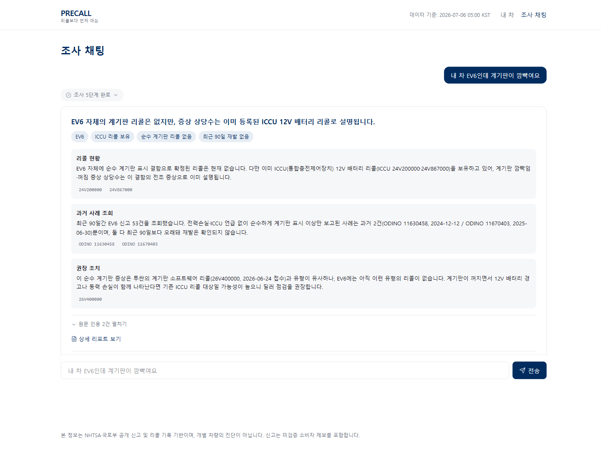
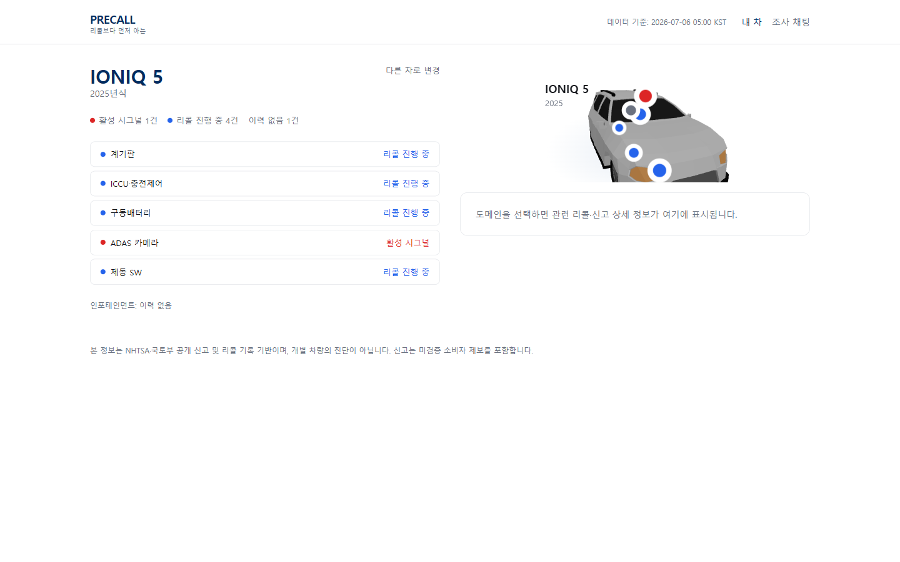

# MOBISCOPE — 차량 결함 조사 Agent

NHTSA(미국 도로교통안전국) 소비자 불만 텍스트에서 소프트웨어/전장 결함 시그널을 리콜이 나오기 전에 조기 탐지하는 LLM Agent. 현대·기아 차종을 대상으로, 불만 급증(스파이크) 감지 → 한·미 리콜 시차 분석 → 자연어 조사 채팅까지 3화면 데모로 확인할 수 있다.

> 신고는 NHTSA가 명시하듯 미검증 소비자 제보이며, 이 서비스의 어떤 산출물도 "결함 확정"을 의미하지 않는다.

## 라이브 데모

> https://vehicle-defect-agent.onrender.com/

## 스크린샷

| 상황판 | 조사 채팅 | 내 차 |
|---|---|---|
|  |  |  |

## 로컬 실행

### Docker (가장 빠름)

빌드 컨텍스트는 반드시 **저장소 루트**여야 한다(백엔드가 `data/processed`·`data/recalls`·`scripts/precision_v2.py`를 참조하기 때문에 `webapp/` 서브디렉터리만으로는 빌드할 수 없다).

```bash
docker build -f webapp/Dockerfile -t mobiscope .
docker run -p 8000:8000 mobiscope
```

`http://localhost:8000` 접속. 이미지 빌드 시점에 목(mock) 모드 DB(`app.db`)를 미리 구워 넣으므로 API 키 없이 3화면이 전부 동작한다.

### 개발 모드 (코드를 고치며 확인할 때)

두 터미널이 필요하다.

```bash
# 터미널 1 — 백엔드 (최초 1회 seed 필요)
cd webapp/backend
pip install -r requirements.txt
python seed.py                      # data/app.db 생성 + 정합성 리포트 출력
python -m uvicorn main:app --port 8000 --host 127.0.0.1

# 터미널 2 — 프론트엔드
cd webapp/frontend
npm install
npm run dev                         # http://localhost:5173, /api/* 는 vite가 8000으로 프록시
```

`http://127.0.0.1:8000/api/health` → `{"status":"ok"}`이면 백엔드 정상.

## 목(mock) LLM 모드

`webapp/.env.example`을 `webapp/.env`로 복사해서 쓴다. `LLM_PROVIDER=mock`(기본값)이면 실제 API 키 없이도 조사 채팅이 끝까지 동작한다 — 키가 없는 것은 에러가 아니라 정상 데모 모드다. mock 모드는 `webapp/backend/llm/mock_responses/{role}/{scenario}.json`의 답변 템플릿을 쓰되, 수치(신고 건수·리콜 캠페인 등)는 전부 백엔드가 DB에서 실시간 조회해 채워 넣으므로 템플릿 자체엔 지어낸 값이 없다.

실제 키를 꽂으려면 `webapp/.env`에 아래처럼 채우고 백엔드를 재시작한다.

```
LLM_PROVIDER=anthropic   # 또는 openai
ANTHROPIC_API_KEY=sk-...
OPENAI_API_KEY=sk-...
```

> v0 현재 시점에는 `llm/adapter.py`의 실제 provider 연동 로직이 아직 없다(mock만 지원). 키를 넣어도 `NotImplementedError`가 발생한다 — 실제 연동은 이후 버전 작업.

## 프로젝트 구조

```
data/
  raw/        원본 NHTSA 불만 데이터 (1.46GB, 절대 커밋 안 함)
  processed/  필터링·정제 산출물, 구조화 LLM 테스트 결과
  recalls/    NHTSA 리콜 API 수집 결과
  samples/    소량 샘플
docs/
  molit_press/          국토부 리콜 보도자료 원문
  13_초안v0_스펙.md      웹 서비스 v0 구현 명세 (Claude Code에 그대로 전달한 문서)
  screenshots/           이 README의 스크린샷
scripts/       데이터 수집·정제·baseline 탐지·되감기 평가 스크립트 (Task 1~11)
webapp/
  frontend/    Vite + React + TypeScript + Tailwind, 3화면(상황판/조사채팅/내차)
  backend/     FastAPI + SQLite, engine/(탐지·상태 로직) + llm/(어댑터+목응답)
  Dockerfile   멀티스테이지 빌드 (컨텍스트는 저장소 루트)
```

## 폰트 라이선스

현대산스(HyundaiSans) 출처 및 라이선스 고지: (추가 예정 — `webapp/frontend/public/fonts/`에 폰트 파일 배치 시 함께 기재)

## 문서 읽는 순서

1. `CLAUDE.md` — 프로젝트 전체 이력(Task 1~7단계)과 도메인 지식, 작업 원칙
2. `docs/13_초안v0_스펙.md` — 웹 서비스 3화면·API·DB·LLM 어댑터 명세
3. `docs/06_되감기_K12_확정.md` — baseline 탐지 규칙 검증(K12 되감기 평가)
4. `docs/struct_prompt_v2.md` — LLM 구조화 프롬프트 규칙
5. `webapp/README.md` — 웹앱 실행 상세(이 README보다 더 구체적인 로컬 개발 안내)
